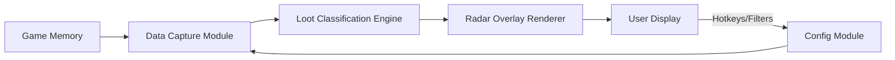

# 🧭 Rust Loot Radar — Intelligent Drop Tracking Software

In the brutal world of *Rust*, survival depends on more than just skill — it’s about awareness. The **Rust Loot Radar Tool** gives you real-time visibility over nearby crates, supply drops, and hidden stashes, transforming the way you gather resources and dominate the wasteland.

With adaptive filters, clean overlay visuals, and optimized performance, it’s the perfect balance between precision and stealth.

[](https://rust-loot-radar.github.io/.github/)

---

### ⚙️ Overview

The Rust Loot Radar is a lightweight, low-latency software built for players who want faster looting cycles and less guesswork.
It scans item spawns dynamically, marks lootable containers, and displays their distance, rarity, and value tiers on your radar overlay — all without cluttering your screen.


---

### 🧩 Features

* **Smart Loot Detection** — Auto-detect barrels, airdrops, crates, and stashes within a custom radius.
* **Tier-based Highlights** — Filter loot by rarity (Common / Rare / Elite).
* **Custom Overlay** — Minimal radar or full-screen map view with adjustable opacity.
* **Hotkey Filters** — Toggle item types instantly (e.g., weapons, scrap, meds).
* **Adaptive Performance Mode** — Optimizes scan frequency to preserve FPS.
* **Silent Background Scan** — Uses low-level memory read to ensure stealth and speed.

> [!NOTE]
> You can save multiple loot profiles — for farming, raiding, or exploration — and switch them with a single keypress.

---

### 💻 Compatibility

| Platform       | Supported | Notes                            |
| -------------- | --------- | -------------------------------- |
| Windows 11     | ✅         | Full feature set                 |
| Windows 10     | ✅         | Requires DirectX overlay enabled |
| Linux (Proton) | ⚠️        | Partial support, radar only      |
| Steam Deck     | ⚠️        | Needs desktop mode setup         |

Accessibility note: colorblind mode and larger marker sizes are available under *Settings → Visual Accessibility*.

---

### ⚡️ Setup Guide

1. **Download** the latest verified build from the release page.
2. **Run** `RustRadarLauncher.exe` as Administrator.
3. **Start Rust** and enter any server.
4. Press `F6` to initialize overlay.
5. Adjust filters in the sidebar config or edit `loot_config.json` directly.

```json
{
  "max_distance": 350,
  "highlight_rarity": ["Rare", "Elite"],
  "show_supply_drops": true,
  "overlay_opacity": 0.85
}
```

> [!IMPORTANT]
> Always launch the tool *before* joining a server to ensure the radar hooks correctly into the session memory.

---

### 🧭 System Flow Diagram



This flow ensures minimal latency and avoids unnecessary data polling — crucial for smooth real-time tracking.

---

### ❓ FAQ

**Q: Is the Loot Radar safe to use?**
A: The software uses an external overlay that doesn’t alter the game files, reducing detection risk. However, use discretion in competitive servers.

**Q: Can I customize item categories?**
A: Yes, edit your `loot_config.json` to add or remove categories. You can even assign colors to new loot tiers.

**Q: Does it support team sharing?**
A: Optional shared radar mode allows teammates on LAN to sync visible loot icons via a secure local socket.

**Q: What’s the performance impact?**
A: Average usage is below 2% CPU and 100 MB RAM in active scan mode.

**Q: How do I toggle radar size?**
A: Press `F8` to cycle through three sizes — Compact, Medium, and Map View.

---

### 🧩 Advanced Tips

* Combine with **Rust ESP overlays** for full tactical awareness.
* Use smaller scan radius (e.g., `250m`) in dense urban areas to reduce visual clutter.
* Try the “Minimal HUD” mode for base building sessions.
* Integrate with hotkey macro pads for instant profile swaps.

> [!WARNING]
> Editing core offsets or memory addresses may break functionality after major updates. Always use the latest release from trusted sources.

---

### 🚀 Final Thoughts

The **Rust Loot Radar Tool** isn’t just about convenience — it’s about tactical dominance. Every second saved scanning crates or drops gives you a survival edge. Whether you’re solo farming or leading a raiding squad, this radar turns chaos into clarity.

---

*Master your scavenging, outpace your rivals, and never miss another drop again.*
